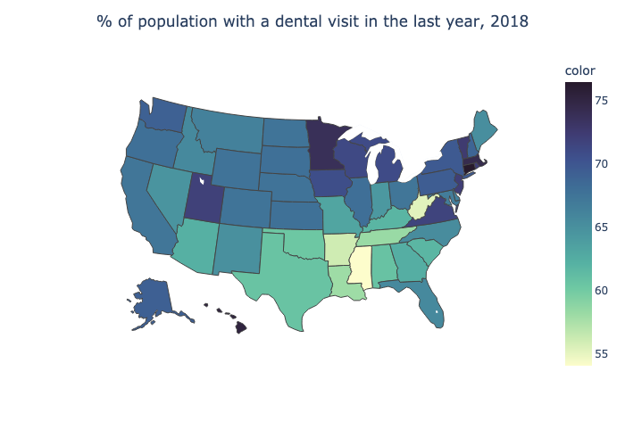
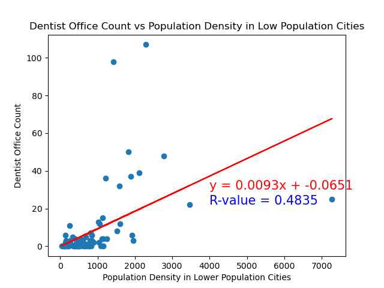
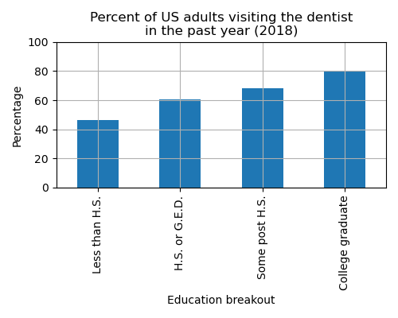

# Authors
Columbia Data Analytics Bootcamp

December 2023

Project 1 

Authors: David Castaño, Jennifer Kim, Kathryn Lesh, and Scott Zuckerbrow

# Introduction

In this project we study oral health in the United States. The starting point is CDC data showing that there is wide variation by state in the percentage of the population that visits the dentist. Because oral health is a key component of overall physical health, it is important the understand why people do not visit the dentist, and what can be done to encourage and support oral health. 

<br>

# Research questions 
* What factors might explain differences by-state percentage with dental visits in 2018? We examined:
  * Availability of dentists by state
  * Availability of dentists by city size
  * Policy differences and affordability, with Medicaid reiumbursements as a proxy
* What are the populations that are and are not making dental visits?

<br>

# Data Sources

## Centers for Disease Control and Prevention (CDC)

The data on patient behavior that we analyzed for this project stems from the Behavioral Risk Factor Surveillance System (BRFSS) by the Centers for Disease Control and Prevention (CDC). Since 1984, the BRFSS has been conducting telephone surveys to collect health-related data from (noninstitutionalized) adult U.S. residents. The BRFSS asks about many aspects of people’s health status, such as health care access, exercise, chronic health conditions, oral health, tobacco and alcohol use, immunizations, and so on. BRFSS responses are self-reported in landline and cell phone interviews. State health departments send the data to CDC for processing, weighting and analysis. The data we downloaded as CSV files from the CDC’s website and analyzed had already been weighted to make the data representative of the populations from which they were collected. For more information about the sampling weights, visit the [BRFSS documentation](https://www.cdc.gov/brfss/data_documentation/index.htm). Therefore, the data available from the site are already weighted values. 

We focused on oral health for this research project. The BRFSS data we downloaded and analyzed was a survey in which respondents who reported whether they had visited the dentist or a dental clinic in the past year. 

## American Dental Association

Dentist demographic data come from the [American Dental Association Health Policy Institute (HPI)](https://www.ada.org/resources/research/health-policy-institute), specifically [HPIData_Supply_of_Dentists_2022.xlsx Table 3](https://www.ada.org/-/media/project/ada-organization/ada/ada-org/files/resources/research/hpi/hpidata_supply_of_dentists_2022.xlsx). 

## US Census Bureau 
We sourced city population data from the US Census Bureau, which provided a comprehensive list of the cities in the United States. Common population definitions for an urban area (city or town) range between 1,000 and 50,000 people, with most U.S. states using a minimum between 1,000 and 5,000 people. We discarded 'cities' with populations under 1,000. 

## Geoapify API Integration
API calls to Geoapify were made to determine the number of dentist offices within a 10,000-meter radius of randomly selected cities. 

<br>

# Project Inspiration
Our project started when we looked at a map showing that there is significant variation by state in terms of the percentage of the population that has visited a dentist of dental clinic in the last year. We show the map below. We focus on the year 2018 because some of the data is collected only in even years, and 2020 (while available) was the first year of the pandemic, while 2022 is not yet available for some data. 
<br>
<br>

<br>

# Research questions 
* What factors might explain differences by-state percentage with dental visits in 2018? We examined:
  * Availability of dentists by state
  * Availability of dentists by city size
  * Policy differences and affordability, with Medicaid reiumbursements as a proxy
* What are the populations that are and are not making dental visits?
<br>
<br>

# Dentist Availability in the U.S.

## Introduction

This section delves into the number of dentists per capita in each US state, and examines the relationship with the percentage of respondents in the BRFSS data who reported visiting the dentist in the last year. The goal is to uncover patterns and correlations to contribute to a deeper understanding of oral health behaviors across different states.


## Initial Investigation of Data

We identified states with the lowest and highest rates of dental visits in 2018:

### States with the Lowest Rates:
1. Mississippi (54.1%)
2. West Virginia (55.3%)
3. Arkansas (56.1%)
4. Louisiana (58.1%)
5. Tennessee (58.3%)

According to Wikipedia, all of these states are in the bottom quintile of [states by median household income](https://en.wikipedia.org/wiki/List_of_U.S._states_and_territories_by_income) in 2018.

### States with the Highest Rates:
1. Connecticut (76.5%)
2. Hawaii (75.3%)
3. Massachusetts (74.4%)
4. Minnesota (73.9%)
5. Vermont (72.6%)

Interestingly, Connecticut, Hawaii, and Massachusetts are all in the top quintile of states by median household income according to Wikipedia, but Minnesota and Vermont are in the second and third quintile, respectively. Notably, states with both low and high dental visit rates exhibit diverse socioeconomic profiles, challenging the assumption that dental visits are solely income-dependent.

## Availability of Dentists, by State

### Data Collection and Preprocessing

Dentist demographic data from HPI are organized by years and states. Preprocessing steps include omitting non-data rows, excluding the District of Columbia, and focusing on relevant columns.

#### Key Data Points (2018):
- The "average" state had 58.1 dentists per 100,000 people.
- Range: 41.7 (Alabama) to 82.9 (Massachusetts)

### Analysis and Visualization

The following bar graph visualizes the number of dentists per 100,000 residents by state, revealing intriguing variations. Delaware, notably at the lower end, prompts questions about potential influences such as its small size and proximity to neighboring states.
<br>
<br>


<br>
In the following map, we visualized "Dentists per 100,000" by state in 2018. Using this map, we explored our hypothesis that states with more dentists per 100,000 had a higher percentage of people who visited the dentist.

<br>

<br>
It seems that there is a correlation, but it is not clearcut. Mississippi, Arkansas, and West Virginia have a low density of dentists and low percentage of dental visits. But Minnesota ranks 20th for dentist density and fourth for percentage of the population making dental visits. Thus we move to more quantitative analysis. 


## Correlation Analysis

### Correlation of Dentist Population with Dental Visits

The correlation between dentists per 100,000 and the percentage of the population visiting the dentist is 0.67. This strong positive correlation suggests a significant relationship between dentist density in a state's population and the likelihood of its residents visiting the dentist.


## Results

The analysis underscores the importance of dentist availability in influencing oral health behaviors. States with higher dentist density tend to have a larger percentage of the population engaging in regular dental visits. This finding contributes valuable insights for policymakers and public health initiatives aiming to improve oral health on a regional level.

## Next Steps

Further exploration may involve dissecting the specific factors contributing to the observed correlation, including socioeconomic variables, geographical considerations, financial rewards for dentists, and accessibility to dental care for patients.

<br>
<br>
<br>

# Dentist Office Count

Next we consider the availability of dentists at a more granular level. We consider the count of dentist offices within a 10,000-meter radius of various cities, and we compare the results for cities with populations less than 100,000 and populations greater than 500,000. (According to the US Census Bureau, small-city populations start at 100,000 people.)

## Data Collection and Preprocessing

We sourced city population data from the US Census Bureau, which provided a comprehensive list of the most populous cities in the United States. Unnecessary columns were removed, and cities with populations less than 1,000 were filtered out. The columns we chose to focus on were: city, state, longitude, latitude, population, and population density.

The decision to remove locations with a population less than 1000 people was made based on the definition of an 'urban area' by the US Census Bureau. Common population definitions for an urban area (city or town) range between 1,000 and 50,000 people, with most U.S. states using a cutoff between 1,000 and 5,000 people as the lowest population level to qualify as 'urban'.

### Random City Selection
To conduct a detailed analysis, we randomly selected cities to represent both high and low population densities. Two separate DataFrames were created, each containing 85 random cities. One DataFrame included cities with populations greater than 500,000, while the other included cities with populations less than 100,000.

### Geoapify API Integration
We made API calls to Geoapify to determine the number of dentist offices within a 10,000-meter radius of each selected city. The data was incorporated into the respective DataFrames for high-population and low-population cities.

#### Challenges
While leveraging the Geoapify API, we encountered challenges arising from the unclear specifications in the API documentation regarding result limits for this type of search. Particularly noteworthy was the scenario in larger cities, where a 10,000-meter radius sometimes yielded 300+ dental offices. This raised concerns about the coordinates used, as the specified radius might not comprehensively cover an entire city, especially for larger urban areas. Conversely, for smaller cities, the results might include dental offices from neighboring locations, potentially influencing the accuracy of our analysis. This highlights the complexities faced in ensuring precise and representative data collection.

### Ratio of Dentist Office Count to Population Density
We added columns for the ratio of the number of dentist offices to the population density for each city, in each of the two DataFrames (high and low population cities).

## Visualizations of Dentist Office Count

### Geographic Plots
We utilized HoloViews (hvplot) to create visualizations of the United States, focusing on the selected cities.

### Dentist Office Count Maps
We began with geographic maps using circle sizes corresponding to the count of dentist offices, providing an intuitive representation of the distribution.

**Low Population Cities:**
<br>


**High Population Cities:**
<br>


### Dentist Offices per Population Density Maps

Next we looked at maps of the same underlying data, but this time using circle sizes based on the ratio of the number of offices to population density, allowing for a comparative analysis.

**Low Population Cities:**
<br>


**High Population Cities:**
<br>


### Quantitative analysis of Population Density vs. Dentist Office Count

#### Scatter Plots and Regression Analysis

We used scatter plots to visualize the relationship between population density and dentist office count for both high and low population cities. Lines of best fit provide insight into the trends in the data. The regression analysis included the calculation of the r-values, representing the strength and direction of the linear relationship.

**Low Population Cities:**
<br>


**High Population Cities:**
<br>


#### Correlation Coefficient Comparison using Z-Test

To look for potential differences between high and low population cities, we compared the correlation coefficients of dentist office count versus population density using a z-test. While the r-values imply a more pronounced positive correlation between Population Density and Dentist Office Count in higher population cities, the outcome of the z-test yields a p-value that surpasses the significance threshold. As a result, we cannot reject the null hypothesis: there is insignificant evidence that the level of correlation is different between high-population and low-population cities.  

# Results
This analysis revealed significant disparities in the count of dental offices across cities of lower and higher populations. The visualizations provided valuable insights into the distribution of dentist offices and highlighted the impact of population density on dental care availability. 

<br>
<br>
<br>

# Dental Care Coverage and Utilization

## Medicaid coverage 

One of our hypotheses was that high costs hinder people from seeking and receiving dental care, and that this financial burden might explain the regional differences in the frequency of visiting the dentist among our study population. We looked at Medicaid’s reimbursement program as a proxy for affordability or access to dental care in different states.

The data on reimbursement for dental care services within state Medicaid programs were limited or not available. According to the American Dental Association (ADA)’s Health Policy Institute (HPI), 61% of adults have private dental insurance, and Medicaid programs for adult dental benefits coverage vary by state. However, the ADA recently released their Medicaid reimbursement study findings from 2022. We analyzed these data to compare the Medicaid reimbursement as a percent of dentist charges between different states.

The Medicaid reimbursement bar chart below shows Delaware at the top level (76.9%) of reimbursed adult dental care services, while at the bottom we find New Jersey with the lowest percent (13.3%) reimbursed. There 11 states with Medicaid programs that covered emergency dental services or no reimbursement at all: Alabama, Arizona, Florida, Georgia, Hawaii, Maryland, Nevada, New Hampshire, Tennessee, Texas and Utah. We plotted the reimbursement percentages on a bar graph displaying the lowest to highest from left to right and on a map for an easier comparison between states.


<br>

The Medicaid reimbursement map indicates that states with more visitors to the dentist within the past year do not necessarily have higher percent of dental care costs reimbursed by Medicaid. Some states such as Texas and Georgia with limited Medicaid data (areas shaded in gray) had lower percentage of people going to the dentist, which we expected. In these jurisdictions, people who need financial assistance with dental care might not be able to make it to the dentist. Overall, our results suggest that there is weak or no association between the frequency of Americans visiting the dentist and the extent to which government could reimburse their dental costs.


## Reasons not to visit the dentist

In addition to Medicaid reimbursement, we used self-reported survey data from HPI (Health Policy Institute of the American Dental association) to better understand why people are not visiting a dentist more frequently. The survey asked how often people visit the dentist, their insurance status, source of insurance, and potential issues they have accessing dental services. We looked at the data collected from this survey conducted in 2015. Specifically, we looked at the responses from people who visited the dentist within the last year by source of dental benefits (private, Medicaid, and no dental coverage), and from those who did not visit the dentist and their reasons for not seeking dental care. Like BRFSS, the HPI’s survey responses are weighted to accurately represent the population the data were drawn from.

We looked at the distribution of who visited the dentist among the survey respondents, and if more or fewer people visited the dentist based on what type of dental benefits they had. One of the pie charts shows proportion of people with private dental insurance going to the dentist are roughly fifty-fifty. The Medicaid group showed a stark difference: 80% said they did not visit the dentist, while 20% went to the dentist.


When asked why they did not visit the dentist more often, people said cost was their primary concern regardless of their income or type of dental benefits. Over 50% of the survey respondents across all income levels said cost was their top reason for not visiting the dentist (see below). When we compared different groups of dental benefits, more people (70%) with no dental coverage than those with Medicaid (50%) responded that they did not go to the dentist in the past year.


<br>
<br>
<br>

# Adults Dental Visit Information

In this section we analyze adults aged 18+ who did or did not report a dental visit in 2018, as well as adults aged 65+ who had lost 6 or all their teeth, by state. The report also includes five different breakout categories (Age, Education, Gender, Income, & Race), to see the effect of those categories on dental vist rates. 

## Data Collection and Preprocessing
#### **Adults 18+ to 65+ years & categories dentist information**

In this section we collect, cleaned, organized & interpret the Data specifically for Adults 18+ who have or have not visit the dentist or dental clinic in 2018 & Adults 65+ who have lost 6 or all their natural teeth due to tooth decay or gum disease.
```
5 Top Locations Adults 18+ who visit dentist by % (2018)
Connecticut          76.5 %
Hawaii               75.3 %
Massachusetts        74.4 %
Minnesota            73.9 %
Vermont              72.6 %
```
<br>

<br>
<br>

```
5 Top Locations Adults 18+ who have not visit dentist % (2018)
Mississippi         45.9 %
West Virginia       44.7 %
Arkansas            43.9 %
Louisiana           41.9 %
Tennessee           41.7 %
```
<br>

<br>
<br>

```
5 Top Locations Adults 65+ who have lost 6 or all their natural teeth due to tooth decay or gum disease.
West Virginia       54.8 %
Mississippi         50.5 %
Kentucky            46.2 %
Arkansas            45.3 %
North Carolina      43.6 %
```
<br>

<br>
Interestingly, when we look at states where folks aged 65 and older have lost six or more teeth and compare that with states where people visit the dentist the least, it turns out that three states are in both groups. This may suggest a connection between not going to the dentist often and older adults losing a significant number of teeth.
<br>

#### Adults dentist visit in the past year by 5 Categories

In this section of the report we analize and interpret the average porcentage of all 54 locations of the united states by Adults who visit the dentist or dental clinic by different categories(Age, Education, Gender, Income & Race).
- **Age** 
```
Dental visits in 2018 by Age from highest to lowest %
18-24         		   69.3 %
55-64 		           68.3 %
45-54 	                   68.1 %
65+ 		           67.8 %
35-44 		           65.5 %
25-34 		           60.8 %

```
<br>

<br>

- **Education** 
```
Dental visits in 2018 by Education from highest to lowest %
College graduate   80.0 % 
Some post H.S. 	   68.0 %
H.S. or G.E.D. 	   60.8 %
Less than H.S. 	   46.1 %

```
<br>

<br>

- **Gender** 
```
Dental visits in 2018 by Gender from highest to lowest %
Female 	         69.1 %
Male 	         63.8 %

```
<br>

<br>

- **Income** 
```
Dental visits in 2018 by Income from highest to lowest %
$50,000+          78.1 %
$35,000-$49,999   64.3 %
$25,000-$34,999   57.3 %
$15,000-$24,999   51.2 %
<$15,000 	  46.8 %


```
<br>

<br>

- **Race** 
```
Dental visits in 2018 by Race from highest to lowest %
White 		    69.7 %
Multiracial 	    61.3 %
Black 		    60.5 %
Hispanic     	    59.1 %

```
<br>

<br>
<br>

# Conclusions

This comprehensive analysis of oral health in the United States provides valuable insights into factors influencing dental care utilization, variations in dentist availability, and disparities across different demographics. The research questions guided the exploration of multiple dimensions, and the findings contribute to a deeper understanding of the complexities surrounding oral health behaviors.

### Dentist Availability and Dental Visits

The investigation into dentist availability across states revealed a strong positive correlation between the density of dentists per 100,000 residents and the percentage of the population visiting the dentist. States with higher dentist density tended to have a larger percentage of residents engaging in regular dental visits. This correlation underscores the crucial role of accessibility in shaping oral health behaviors. Further exploration into the specific factors influencing this correlation, including socioeconomic variables and geographical considerations, could provide more nuanced insights for targeted interventions.

### Dentist Office Count and Population Density

The analysis of dentist office count within different city sizes highlighted significant disparities in dental care availability. Visualizations using maps and scatter plots provided a clear representation of the distribution of dentist offices, emphasizing the impact of population density on dental care access. The comparison between high and low population cities, along with correlation coefficient analysis, revealed that while there are differences in dentist office count, there is no statistically significant difference in the correlation between population density and dentist office count. This suggests that factors beyond population density contribute to the observed variations.

### Dental Care Coverage and Utilization

The exploration of Medicaid reimbursement as a proxy for affordability or access to dental care in different states offered insights into the weak or no association between the frequency of Americans visiting the dentist and the extent of government reimbursement for dental costs. The analysis of self-reported survey data from the American Dental Association's Health Policy Institute provided a nuanced understanding of why people visit the dentist or choose not to. Cost emerged as a primary concern across income levels and types of dental coverage, indicating that financial barriers significantly impact dental care utilization.

### Adults Dental Visit Information

The detailed breakdown of dental visits by different categories, including age, education, gender, income, and race, highlighted variations in oral health behaviors. Notable findings include higher dental visit percentages among college graduates, females, and those with higher income. The analysis of Adults 65+ losing natural teeth due to tooth decay or gum disease revealed variations by state, emphasizing the need for targeted interventions to address specific oral health challenges in different regions.

In conclusion, this project provides a multifaceted understanding of oral health in the United States, laying the groundwork for informed policy decisions and public health initiatives. The findings underscore the importance of accessibility, affordability, and targeted interventions to improve oral health outcomes across diverse demographic groups and geographic locations.


# Limitations
We describe data sources in detail, but we note that we are using data from different years in our analysis. For patient visits, we use data from 2018, the most recent pre-pandemic year for which CDC data are available. Geographical data obtained by API calls are from December 2023. Medicaid coverage data are from 2022, the only year for which we found data. Thus this study should in some sense be considered as "proof of concept" undertaken with the caveat that drawing actionable conclusions should be based, at the very least, on data that describe the same time period or for which change-over-time can be documented.

# Future directions

Previous research studies suggest that since the Affordable Care Act (ACA) was implemented in 2014, Medicaid expansion and coverage of Medicaid dental benefits improved oral health among low-income adults. Ideally, we would have studied the Medicaid reimbursement data and dental visit rates over time, both before and after the ACA, to see if the ACA increased the frequency of dentist visits among Americans. Unfortunately, the ADA only had the 2022 data publicly available. Therefore, when interpreting our Medicaid reimbursement analysis, we had to assume that there were no changes in Medicaid reimbursement programs for dental care services between 2018 and 2022. In a future project it would be interesting to see if ADA data for Medicaid reimbursement become available for earlier years, which would allow us to see if the ACA encouraged people to make more frequent dental care visits. 
